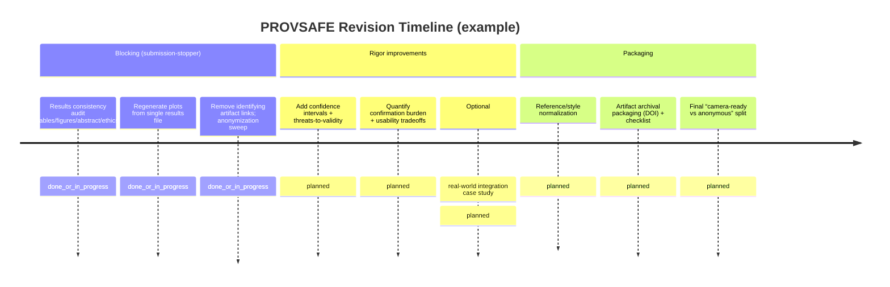

# Pre-submission Review Report for “PROVSAFE” Manuscript

## Executive summary

This manuscript presents **PROVSAFE**, a tool-call–boundary defense for tool-using LLM agents in smart homes, grounded in provenance tracking and “provenance-gated” capability/policy enforcement (main text pp. 1–16). The conceptual framing—**data provenance as the missing primitive** for distinguishing user-intended actions from attacker-injected instructions—is strong and well-motivated (pp. 1–2). The system architecture (e.g., enforcement proxy + provenance DAG + declarative policy engine) is clearly communicated, and the paper includes threat modeling, formal properties, implementation details, and extensive evaluation sections (pp. 4–16).

However, the manuscript is **not yet ready for peer review** in its current state due to **high-severity internal inconsistencies and reviewability blockers**:

- **Numerical inconsistency across abstract, figures, tables, and ethics statement** (e.g., different model counts, trial counts, ASR/TSR values; see pp. 1–2, 10, 12, 18). This will trigger immediate reviewer skepticism about experimental rigor and version control.
- **Anonymity-breaking “Data Availability” disclosure**: a public repository link and package/install details appear in the submission (p. 18). For double-anonymous venues, this is a common desk-reject cause (see anonymization guidance on removing identifying information and metadata; this also applies to repository/usernames and other identifying links). citeturn1search2turn1search9
- **Out-of-date or mismatched evaluation plots**: Figures appear to use a different set of results than Tables 1–2 (pp. 10–12), which further undermines credibility.

If these are corrected, the work has the potential to be a compelling submission to **security/systems-style venues** (conference proceedings or journals) that value enforceable security primitives, systems design, and reproducible evaluation. The paper already includes important transparency elements such as an ethics statement and data availability section (p. 18), and it references a standards-based provenance model (pp. 1–3) aligned with the W3C provenance family. citeturn0search4turn0search5turn0search6

## Manuscript snapshot and suitability

**What the paper is (scope fit, currently implied):**
- Domain: security for tool-using LLM agents in smart-home-like environments; primary threat is indirect prompt injection via untrusted tool outputs (pp. 1–5).
- Core idea: maintain a provenance DAG over inputs/tool outputs/derived facts and enforce tool calls using declarative policies conditioned on provenance and risk tiers (pp. 1–9).
- Evaluation: synthetic benchmark scenarios with mock tools, multi-model tests, baselines, attack taxonomy, and ablations (pp. 10–16), plus an appendix of detailed outcomes (from p. 18).

**Format/structure as submitted:**
- Template appears to be the entity["organization","ACM","computing society publisher"] `acmart` two-column style (PDF metadata; main text layout), suggesting an ACM-like conference/journal workflow (submission rules may include double-anonymous review, line numbers, artifact appendices, etc.). citeturn1search9
- Main sections: Introduction → Background → Threat Model → System Overview → Policy/Provenance → Enforcement Proxy → Implementation → Evaluation → Discussion → Related Work → Conclusion (pp. 1–16), then References (p. 17), then Ethics + Data Availability + Appendix (pp. 18–21).
- Length: **22 pages total**, with **References starting on p. 17**. Many conferences cap main text to ~8–12 pages (references excluded), while journals allow longer; without a specified target venue, length is a risk until you align it to a chosen category. (Examples of common “main body page limits excluding references/appendices” exist across ACM proceedings-style calls.) citeturn6search0turn6search1

**Unspecified (must be flagged for submission readiness):**
- Target venue (conference/journal/workshop) and its page/format rules.
- Intended audience (security systems researchers vs. ML/agent evaluators vs. IoT practitioners).
- Required citation style (numeric vs. author–year), though current formatting is numeric.
- Whether the authors plan double-anonymous review (the author block is anonymized, but the body contains identity-revealing data availability).

## Analytical assessment across the requested criteria

Below, each criterion includes (a) concise findings, (b) prioritized actionable revisions with examples/suggested wording, and (c) effort estimate (low/medium/high).

### Overall structure and organization

**Findings**
- The macro-structure is appropriate for a systems/security submission: clear separation of background, threat model, system design, implementation, evaluation, and discussion (pp. 1–16).
- The paper includes **Ethics Statement** and **Data Availability**, which is a plus for many venues (p. 18).
- The **largest structural weakness** is *organizational coherence of results reporting*: multiple parts of the manuscript appear to reflect different experimental runs/versions (abstract vs. main results vs. figures vs. ethics statement). This is not a “writing polish” issue; it is a **version synchronization / correctness** issue.

**Actionable revisions (priority order)**
1. **Establish a single “source of truth” for results** (tables, figures, abstract, ethics statement, appendix) and re-generate all derived artifacts from one script/run.  
   - Practical step: treat Tables 1–2 (p. 10) as canonical *only if they match your final logs*, then regenerate Figures 5–6 and rewrite the abstract metrics to match.
2. **Resolve length and appendix formatting** once the target venue category is chosen. Some appendix pages have large unused whitespace (e.g., pp. 20–21), which wastes page budget and can exceed strict limits.
3. **Add (or enable) review-mode line numbers** if the likely venue expects them (common in some ACM workflows via `review` option). citeturn1search9

**Effort**: **Medium** (but blocking): typically 2–5 days if experiments are already scripted; longer if re-running compute is required.

### Clarity and coherence of argument and contribution

**Findings**
- The problem statement and motivating attack are clear and concrete (p. 1).
- The central thesis (“provenance is the missing primitive”) is coherent and consistently reinforced from introduction through discussion (pp. 1–3, 13–15).
- The main risk to coherence is again the **conflicting quantitative narrative**, which undermines the “what did you actually show?” story even when the conceptual argument is strong.

**Actionable revisions**
1. **Tighten the “contribution narrative” into a stable 3–4 sentence spine** used consistently in abstract + intro + conclusion. Example wording (to adapt after numbers are finalized):  
   - “We introduce provenance-gated capability enforcement for tool-using LLM agents, implemented as an enforcement proxy that traces tool-call argument lineage through a provenance DAG and applies declarative risk- and scope-aware policies at the tool boundary.”  
2. **Make scope limits explicit earlier** (end of intro or threat model): explicitly list what is out of scope (e.g., compromised proxy, compromised tool executors, physical-layer attacks) and why. The paper already discusses some exclusions (e.g., physical-layer threats) (p. 4); move a short version up.
3. **Add a short “Why this is not just taint tracking” summary** early (intro or background) pointing to (i) LLM opacity, (ii) semantic provenance resolution, (iii) usability-driven policy gating rather than blanket taint denial (pp. 2–3). This helps reviewers quickly place novelty.

**Effort**: **Low–Medium** (1–3 days), assuming results are stabilized.

### Literature review and positioning

**Findings**
- The paper cites core prompt-injection work, benchmark suites, and provenance foundations, and includes a dedicated Related Work section (pp. 15–16; refs p. 17+).
- Strength: it positions itself at the tool-call boundary and contrasts with prompt-level/detection-only approaches (p. 15–16).
- Opportunity: reduce reliance on journalistic sources where primary/technical sources exist, and sharpen the “closest work” comparison with more structured axes.

**Actionable revisions**
1. **Convert “comparisons” into a small, explicit taxonomy table** in Related Work (or earlier):  
   Axes: *enforcement point* (prompt/tool boundary/tool runtime), *tracks lineage?* (Y/N), *semantic matching?* (Y/N), *deterministic enforcement?*, *user burden*.
2. **Prefer primary sources for key claims** (e.g., system behavior incidents). Where a journalistic source is used for context, pair it with a technical report, disclosure, or peer-reviewed analysis when available.
3. **Cite the standard provenance model precisely and consistently**: the paper grounds itself in the entity["organization","W3C","web standards body"] PROV family; ensure you cite the final Recommendation where appropriate and be consistent about PROV-DM vs. constraints/notation. citeturn0search4turn0search5turn0search6

**Effort**: **Medium** (3–7 days), depending on how much restructuring you do.

### Methodology and reproducibility

**Findings**
- The methodology is thoughtfully designed: clear attack taxonomy, scenario counts, baseline definitions, and tool danger criteria are described (pp. 10–11).
- The implementation section includes unusually helpful reproducibility details: deterministic mock tools, seeded RNG, model serving setup, overhead measurements (pp. 9–10).
- The largest reproducibility blocker is **not** missing detail—it is that the paper currently contains **self-contradictory experimental descriptions** (e.g., number of models and trials differs across sections; pp. 1–2 vs. 10 vs. 18).

**Actionable revisions**
1. **Repair internal consistency first**:  
   - Abstract (p. 1) vs. Results/Contributions narrative (p. 2) vs. Evaluation tables (p. 10) vs. Ethics statement (p. 18) must agree on: models evaluated, number of scenarios, total trials, ASR/TSR/FPR, and the definition of “attack evaluations.”
2. **Add statistical uncertainty for proportion metrics** (ASR/TSR/FPR) such as Wilson 95% CIs—this is lightweight and signals rigor. Example wording:  
   - “ASR was 1.56% (10/640), 95% CI [0.85%, 2.85%], and TSR was 95.0% (152/160), 95% CI [90.4%, 97.4%].”  
   (Numbers shown here are computed from the values in Table 1 (p. 10); recompute after finalizing.)
3. **Artifact packaging / archival**: The paper states artifacts are available, but linking to a non-archival repo can be fragile. For venues with artifact badging, artifacts typically must be in a stable, publicly accessible archive with a persistent identifier (and personal pages are not acceptable). citeturn0search0turn4search1  
   - Suggested wording (camera-ready): “We provide an archival artifact (DOI) containing code, configs, benchmarks, and results sufficient to reproduce Tables/Figures X–Y.”  
   - Suggested wording (double-anonymous submission): “Artifacts will be released upon acceptance / via an anonymized archive provided in supplementary material.”

**Effort**: **High** if re-running experiments is needed; otherwise **Medium** (about 1–2 weeks including packaging).

### Results and interpretation

**Findings**
- The results section is *structurally strong*: it states RQs, metrics, baselines, and provides breakdown analysis of defense layers and failure modes (pp. 10–14).
- The paper appropriately identifies residual weaknesses (encoding obfuscation; policy gaps) and discusses mitigations (pp. 11–14).
- Critical flaw: **Figures 5–6 do not match Tables 1–2** (pp. 10–12). For example, Table 2 reports ASR values (e.g., No Defense 25.94%, Pattern Filter 7.50%, PROVSAFE 1.56%), while the corresponding plot labels show different values (e.g., No Defense 12.34%, Pattern Filter 3.12%, PROVSAFE 0.16%) (pp. 10–12). This will be interpreted as either an error or selective reporting.

**Actionable revisions**
1. **Regenerate all plots from the same results file used for the tables** and ensure captions match. Do not manually edit plot labels; tie them to the data.
2. **Add a “threats to validity” paragraph to evaluation** (even if you also cover it in Discussion) acknowledging: synthetic mock tool backends, chosen “dangerous call” patterns, model serving specifics, and any nondeterminism from sampling.
3. **Strengthen the “realism bridge”**: add at least one realistic case study (even small) showing integration with a real agent framework or community-standard environment, or explicitly justify why mock backends are sufficient for the security claim. Reviewers in systems/security often demand at least one “end-to-end” integration story.

**Effort**: **Medium–High** (3 days for plot fixes; 2–4 weeks if adding a real-world integration study).

### Writing quality, grammar, and style

**Findings**
- Overall writing quality is high for a technical systems paper: terminology is defined, sections flow logically, and the voice is consistent.
- The primary writing quality issue is not grammar but **consistency of terminology and numbers**. There are also places where dense technical detail could be streamlined (especially in the abstract).

**Actionable revisions**
1. **Shorten and de-densify the abstract**: aim ~180–250 words unless the target venue explicitly allows longer. Keep: (i) problem, (ii) approach, (iii) key results, (iv) main limitation. Move low-level details (e.g., embedding model name, threshold) to body.
2. **Run a “terminology consistency pass”**: ensure “attack evaluations,” “defense trials,” “scenarios,” and “TC=0” categories are consistently defined once and reused.
3. **Add one paragraph-level roadmap** at the end of Introduction if not already present: “Section 2… Section 3…” (common in systems venues; helps reviewers navigate).

**Effort**: **Low–Medium** (2–5 days).

### Figures/tables quality and captions

**Findings**
- System diagrams (e.g., architecture and proxy workflow) are clear and visually professional (e.g., pp. 6, 8).
- Tables for evaluation breakdown and adaptive adversary scenarios are readable (pp. 10, 13, 20–21).
- Major issue: **quantitative figures are inconsistent with tables** (pp. 10–12).
- Secondary issue: several appendix tables occupy only the top portion of a page, leaving large blank regions (pp. 20–21), which is risky under page limits.

**Actionable revisions**
1. **Fix figure–table consistency** (mandatory).
2. **Make plots grayscale-robust and accessibility-friendly**: avoid encoding meaning only via color; use markers/line styles; ensure font sizes are legible in two-column format.
3. **Compress appendix presentation**: use multi-page tables, smaller but readable font, or move long tables to supplemental material if the venue discourages long appendices. Where appendices are allowed, label clearly (A.1, A.2…) and reference them from the main text.

**Effort**: **Medium** (3–7 days).

### References and formatting consistency

**Findings**
- The reference list is extensive (~47 entries) and spans papers, preprints, and web documentation (pp. 17–18).
- Formatting appears mostly consistent with numbered style, but web references vary in detail (some have access dates; ensure all do if required).
- Some non-archival or mutable web sources may draw reviewer criticism unless essential.

**Actionable revisions**
1. **Standardize web citations**: include publisher/organization, title, URL, and “accessed” date consistently (the manuscript already does this for several items; make it universal).
2. **Prefer archival versions**: where an arXiv work has since appeared in a conference/journal, cite the archival version (and optionally arXiv as “preprint”).
3. **Enforce reference–citation integrity**: run an automated check that every in-text citation exists in bibliography and vice versa.

**Effort**: **Low–Medium** (1–4 days).

### Ethical considerations and conflicts of interest

**Findings**
- The paper includes an **Ethics Statement** asserting synthetic benchmarks, no real users/devices/data, and local inference (p. 18). This is good baseline practice.
- The ethics statement currently conflicts with the evaluation description by listing only two models (p. 18) while the evaluation tables claim four models (p. 10). This is both an ethics disclosure quality issue and a reproducibility issue.
- Conflict of interest and funding disclosures are **unspecified** (likely intentionally omitted for anonymous review); that is acceptable in many double-anonymous contexts, but must be planned for camera-ready.

**Actionable revisions**
1. **Make the ethics statement consistent with the rest of the paper** (models used, evaluation method).
2. **Add a short dual-use reflection**: even if attacks are “well documented,” the work systematizes and benchmarks injection vectors. Consider a short paragraph on harm minimization and intended defensive use, aligned with established ICT/security research ethics frameworks such as the Menlo principles. citeturn5search34turn5search0
3. **Prepare COI disclosure language for camera-ready** (even if withheld during anonymous review). Publication-ethics guidance emphasizes disclosure of competing interests and transparent handling. citeturn2search0turn3search0turn3search4

**Effort**: **Low** for consistency fixes; **Medium** if adding a more formal ethics framework discussion.

### Readiness for peer review and likely reviewer concerns

**Findings**
- Conceptually, the paper is strong and identifiable as a systems/security contribution.
- Practically, it is **not ready for submission** until numerical consistency and anonymization are fixed. Some venues will desk-reject anonymity violations outright. citeturn1search2turn1search9

**Likely reviewer concerns (and how to preempt them)**
- “Your results don’t add up; which numbers are correct?”  
  → Preempt by regenerating all figures/tables from a single logged dataset; include a brief “reproducibility capsule” and CIs.
- “This is just taint tracking / provenance is old—what is new?”  
  → Preempt with a crisp novelty claim: boundary-level provenance for opaque LLM computation + semantic provenance resolution + deterministic policy enforcement and audit.
- “Mock benchmarks aren’t real smart homes.”  
  → Preempt with one end-to-end integration (or a strong justification + limitations, and a roadmap).
- “Policy engineering burden and user confirmation fatigue.”  
  → Preempt with policy templates, a policy-testing harness, and concrete confirmation-burden statistics (counts per task, median confirmations).
- “Double-blind integrity is compromised by artifact links.”  
  → Preempt by moving all identifying artifacts to anonymized supplemental or post-acceptance release and ensuring PDF metadata is clean. citeturn1search2turn1search9

**Effort**: **High** to reach “submission-ready” if you also add a real integration study; **Medium** if you focus on consistency + anonymization + plotting + clarity.

## Proposed edits and examples

### Title alternatives

Current title is descriptive but long and does not surface the system name early. Consider:

1. **“PROVSAFE: Provenance-Gated Capability Enforcement for Tool-Using LLM Agents”**  
2. **“Provenance-Gated Tool Sandboxing for LLM Agents in Smart Environments”**  
3. **“From Tokens to Tools: Provenance-Verified Authorization for Tool-Calling LLM Agents”**  
4. **“PROVSAFE: Deterministic Tool-Call Enforcement via Provenance Tracking for LLM Agents”**

### Sample revised abstract

Below is a **model abstract** (you must update the numeric results after reconciling all inconsistencies). It assumes Tables 1–2 are the intended results (p. 10).

> Tool-using LLM agents in smart environments are vulnerable to indirect prompt injection, where adversaries embed malicious instructions inside tool-returned content (e.g., device names, files, calendar events), causing unauthorized tool invocations. Existing defenses often operate at the prompt level or validate tool calls without knowing which inputs influenced an action, making it difficult to distinguish user intent from attacker-controlled context.  
> We present PROVSAFE, a provenance-gated capability sandboxing framework that tracks information lineage in a provenance graph and enforces declarative policies at the tool-call boundary. PROVSAFE labels user commands as trusted and external tool outputs as untrusted, propagates trust conservatively over derivations, and resolves tool-call argument provenance via hybrid syntactic and semantic matching. Policies combine provenance constraints with capability risk tiers, scope restrictions, and rate limits to authorize, deny, or require confirmation for tool calls.  
> In a benchmark of 200 scenarios (160 attacks across eight categories and 40 benign tasks) evaluated across four local open-source LLMs, PROVSAFE reduces attack success while preserving task success, with remaining failures concentrated in encoding obfuscation. We release code, policies, and benchmarks as artifacts to support reproducibility.

Key style differences from the current abstract: fewer low-level implementation details, consistent evaluation statement, limitation called out, and no identity-revealing links.

### High-impact wording edits you should make once numbers are fixed

1. **Abstract + intro results phrasing**: Ensure you use one consistent unit:  
   - Either “attack evaluations” (attacks × models) or “scenarios” (unique prompts) but not both without explicit mapping.
2. **Figure captions**: Avoid absolute claims that depend on numbers if numbers are likely to change; prefer “In our evaluation…” with the actual values backed by regenerated plots.

## Revision plan and risk mitigation

### Priority-ordered revision plan

**Phase 1 (blocking fixes)**
- Reconcile all reported model counts, trial counts, and metrics; regenerate Figures 5–6 and any other plots; update abstract + ethics statement accordingly (pp. 1, 10–12, 18).
- Remove deanonymizing repository/package information from the anonymous manuscript; move it to (i) anonymized supplement or (ii) camera-ready. citeturn1search2turn1search9
- Run an “anonymity audit”: body text, acknowledgements, supplemental, PDF metadata. citeturn1search2turn1search9

**Phase 2 (strengthening for likely reviewer critiques)**
- Add confidence intervals and a short threats-to-validity subsection for evaluation.
- Add confirmation-burden statistics and discuss usability tradeoffs more quantitatively.
- Decide whether to add a real-world integration case study; if not, sharpen limitations and justify the benchmark design.

**Phase 3 (polish and packaging)**
- Standardize references and web citations; prefer archival sources where possible.
- Prepare an artifact package aligned with artifact/badging expectations (archival repository, stable identifier). citeturn0search0turn4search1
- Ensure COI/funding disclosure plan exists for camera-ready, consistent with publication ethics guidance. citeturn2search0turn3search0

### Suggested visualization for the revision plan

## Submission checklist and venue archetype comparison

### Submission checklist

**Manuscript integrity**
- All numeric results consistent across abstract, body text, tables, figures, appendix, ethics.
- Plots generated automatically from logged results; scripts archived.
- Definitions fixed: scenario vs. trial vs. evaluation; dangerous-call criteria.

**Anonymity and policy compliance (if double-anonymous)**
- Author block blank/anonymized; acknowledgements removed.
- No identifying repository links, usernames, package names, or institution-specific details in the body or supplements.
- PDF metadata scrubbed. citeturn1search2turn1search9

**Ethics and disclosures**
- Ethics statement consistent with methods and models used.
- Human-participants declaration: “Not applicable” or compliance evidence if applicable (currently appears not applicable since synthetic). (ACM provides explicit policy expectations.) citeturn4search0
- Dual-use/security ethics reflection aligned with established ICT research ethics frameworks (e.g., Menlo principles). citeturn5search34
- COI/funding disclosure plan ready for camera-ready (even if withheld during anonymous review). citeturn2search0turn3search0

**Reproducibility packet**
- Artifact inventory (code, configs, benchmark scenarios, result logs).
- Clear “how to reproduce Tables/Figures” steps; pinned versions and seeds.
- Archived artifact with persistent identifier if required/encouraged by venue; avoid non-archival personal hosting. citeturn0search0turn4search1

**Presentation quality**
- Figures readable in two-column; grayscale-safe; captions fully explain what is shown.
- Tables numbered sequentially and cited in text.
- References consistent; URLs have access dates as appropriate.

### Common target-venue archetypes

No specific venue is specified, so the table below describes **venue archetypes** commonly used in computing/security/AI-systems research. Acceptance rates and constraints vary widely; numbers below are indicative ranges and should be replaced with the specific rules of your eventual target.

| Venue archetype (generic) | Typical scope fit for this paper | Typical selectivity (rough) | Typical formatting constraints (illustrative) |
|---|---|---|---|
| Highly selective archival conference proceedings | Best fit if you position PROVSAFE as a **systems + security** enforcement primitive with strong evaluation | Often **~10–25%** for large flagship tracks (varies by field and year). citeturn6search4 | Often **two-column**, strict anonymization, and a **main-text page cap with references excluded** in many ACM-style workflows. citeturn6search0turn6search1 |
| Field-specific conference proceedings (mid-scale) | Fit if you emphasize smart environments/IoT + applied security; may value integration case studies | Often **~20–40%** (varies widely; check CFP) | Often similar templates; page caps frequently specified in CFPs, commonly excluding references. citeturn6search0 |
| Archival journal (security/systems/AI applications) | Good fit if you expand realism, threat analysis, and broader generalization; allows longer treatment | “Acceptance rate” often not meaningfully published/comparable; decisions are editorial | Usually more flexible length; more explicit COI/funding disclosures; may require data availability statements and stronger methodological detail. citeturn3search0turn2search0 |
| Workshop / position-paper venue | Good fit if results are not yet fully stabilized; can present the idea early | Often higher acceptance, but variable | Shorter papers, sometimes 4–8 pages; anonymization rules vary; some workshops are non-archival |
| Open-review ML/AI conference track (review platforms) | Fit if you lean into agent benchmarking + model-agnostic defense layers | Acceptance rates vary substantially by year/track; public peer-review ecosystems show wide spreads. citeturn6search3 | Format varies; may allow longer appendices; may have strong policies around anonymity vs. preprints |

### Bottom-line readiness call

- **As-is**: not suitable for submission because consistency and anonymity issues are likely to cause desk rejection or severe reviewer distrust (pp. 1, 10–12, 18). citeturn1search2turn1search9  
- **After Phase 1 fixes** (consistent results + anonymization + regenerated figures): suitable for peer review in many security/systems-style venues, with remaining risk concentrated in “realism/integration” expectations and usability burden quantification.